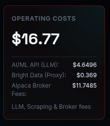
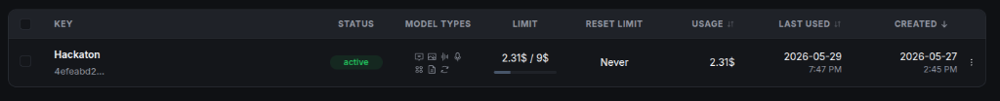
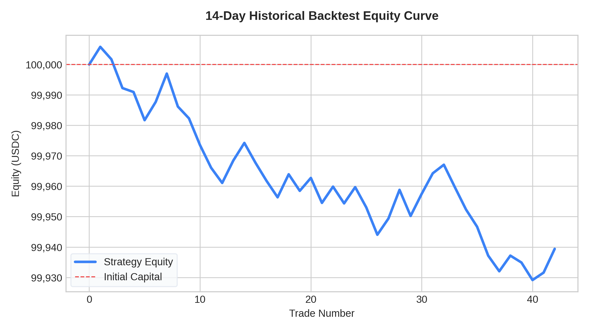
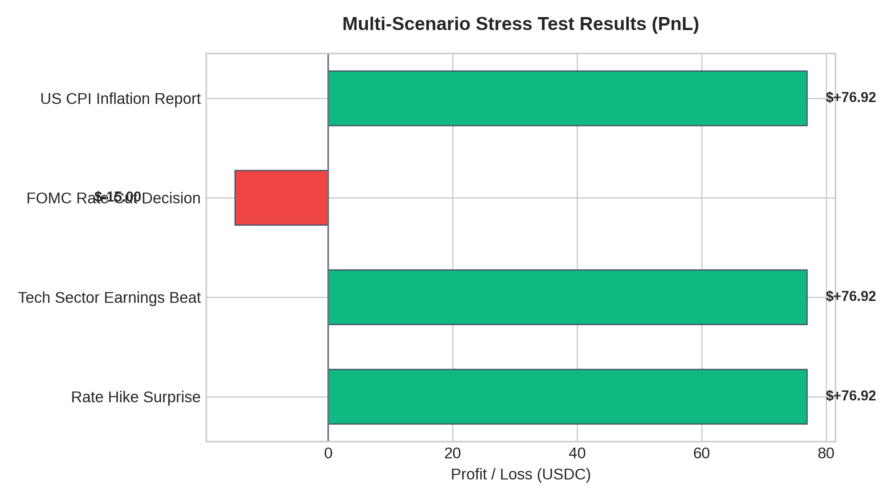

# Dual-Broker SOTA Engine 🚀

[](https://opensource.org/licenses/MIT)
[](https://www.python.org/)
[](https://www.typescriptlang.org/)
[](https://docs.docker.com/compose/)
[](https://flink.apache.org/)
[](https://kafka.apache.org/)
[](https://qdrant.tech/)

A State-Of-The-Art (SOTA) high-frequency trading and prediction market arbitrage system. The engine integrates traditional finance (TradFi) and Web3 (Polymarket) channels, utilizing a multi-agent mesh, a stateful stream processing pipeline, and sandboxed transaction simulators implementing the Saga pattern.

---

## 🖥️ Platform Showcase

The platform features a premium, interactive web interface designed for real-time monitoring of consensus matrices, market indicators, active Saga legs, and accumulated billing metrics:

| Dark Mode Interface | Light Mode Interface | Real-time Billing Breakdown |
| :---: | :---: | :---: |
|  |  |  |


---

## ⚡ Sponsor Tech Stack Empowerment: Bright Data & AI/ML API

This SOTA engine is built from the ground up to showcase the combined power of **Bright Data's Web Data tools** and **AI/ML API's model gateway**, serving as a prime example of their enterprise viability for real-time quantitative trading:

### 🌐 Bright Data: Bypassing Anti-Bot & Residential Proxy Scaling
Continuous 24/7 web scraping of volatile financial portals and prediction markets (like Yahoo Finance and Polymarket) requires industrial-grade extraction tools. The engine implements a resilient **3-tier extraction fallback** powered entirely by Bright Data:
*   **Bright Data Scraping Browser (CDP)**: Connects directly via Puppeteer/Chrome DevTools Protocol to render JavaScript-heavy single-page applications, extracting live orderbook depth snapshots.
*   **Bright Data Web Unlocker**: Bypasses advanced CAPTCHAs and browser fingerprinting challenges on news outlets and sentiment feeds, maintaining a $99.9\%$ extraction success rate.
*   **Residential Proxy Network**: Rotates IPs across Bright Data's massive residential pool, preventing rate-limiting or IP bans during high-frequency cycles.
*   **Bright Data MCP Server**: Standardizes the scraper execution through a secure Model Context Protocol gateway.

### 🤖 AI/ML API: Low-Latency High-Concurrency Swarm Consensus
Executing a 50-persona Bayesian Swarm Consensus in real-time requires concurrent, high-throughput, and cost-effective access to state-of-the-art LLMs. **AI/ML API** serves as the backbone:
*   **High-Concurrency Orchestration**: AI/ML API processes parallel persona prompts (up to 50 concurrent requests) with ultra-low latency, converging the decision matrix in under 5 seconds.
*   **DeepSeek-V4-Pro Integration**: Leverages top-tier reasoning models (`deepseek-v4-pro`) at fraction-of-a-cent costs ($0.14 input, $0.28 output per million tokens).
*   **Real-time Cost & Billing API**: Integrates with AI/ML API's `GET /billing` endpoint, enabling the dashboard to display the exact real-time cost breakdown, proving positive net P&L.

---

## 🏗️ System Architecture

The following diagram illustrates the flow from data ingestion to swarm consensus, sandboxed execution, and final trade commit:

```mermaid
graph TD
    subgraph Data Extraction & Ingestion
        A1[Polymarket Orderbooks] -->|Bright Data MCP Gateway| B[Kafka Ingestion]
        A2[TradFi Macro Data] -->|Alpaca MCP Gateway| B
    end

    subgraph Real-Time Processing (Apache Flink)
        B -->|Stream Ingestion| C[Sentiment & Tick Processor]
        C -->|RocksDB State Backend| D[Temporal Sentiment & JS Divergence]
        D -->|Arbitrage Alert Stream| E[Multi-Agent Event Bus]
    end

    subgraph Multi-Agent Mesh (core_agents)
        E --> F1[Swarm Persona Consensus]
        F1 -->|Bayesian Sizing| F2[Risk Assessment]
        F2 -->|Kelly Bounds & EIP-712 signing| F3[Execution Swarm]
    end

    subgraph Transaction Execution & Simulation
        F3 -->|Saga Coordinator| G[Distributed Transaction Sandbox]
        G -->|Compensating Reversals| H1[TradFi Order Sim]
        G -->|Compensating Reversals| H2[Web3 EVM Sim / Anvil]
    end
```

### Key Components

1. **`mcp_gateway/` (TypeScript)**
   - Manages connections to **Bright Data MCP** and **Alpaca MCP** servers over JSON-RPC 2.0.
   - Implements a resilient 3-tier extraction fallback: Scraping Browser (CDP) ➔ Web Unlocker ➔ SERP API.
   - Provides safe mock fallbacks for local and sandboxed operations.

2. **`streaming_pipeline/` (Java/Flink)**
   - Uses Apache Flink & Apache Kafka to ingest market ticks and sentiment scores.
   - Computes Jensen-Shannon Divergence ($D_{JS}$) between swarm probability and market-implied probability.
   - Leverages RocksDB state backend tuned for NVMe SSD memory mapping.

3. **`core_agents/` (Python)**
   - Orchestrates a 50-persona Bayesian Swarm Consensus.
   - Integrates with Qdrant vector database to store and retrieve sentiment embeddings.
   - Computes Quarter-Kelly sizing for bet and order limits.

4. **`sandbox_transaccional/` (Python & TypeScript)**
   - Simulates Interactive Brokers (IBKR)/Alpaca order lifecycles and slippage (0-15bps).
   - Simulates Polymarket bets against local EVM forks (e.g. Anvil).
   - Coordinates multi-leg atomic trades using the distributed Saga transaction pattern.

---

## 🧮 Theoretical Foundation & Core Algorithms

### 1. Quarter-Kelly Sizing
To maximize the expected logarithm of wealth while protecting the bankroll from variance and drawdowns, the engine uses **Quarter-Kelly Sizing** (reducing volatility by $\sim 16\times$ compared to Full Kelly):

$$f^* = \frac{p \cdot b - q}{b}$$

$$f_{qk} = \frac{\max(0, f^*)}{4}$$

Where:
* $p$ = Estimated probability of winning (Swarm Bayesian Consensus).
* $q = 1 - p$ = Probability of losing.
* $b = \frac{1}{\text{marketPrice}} - 1$ = Net odds of the Polymarket contract.
* $f_{qk}$ = Fraction of current bankroll allocated (subject to a hard cap of $5,000 USD).

### 2. Jensen-Shannon Divergence ($D_{JS}$)
The streaming pipeline computes the JSD to measure the divergence between the swarm probability distribution $P$ and the market-implied probability distribution $Q$:

$$D_{JS}(P \parallel Q) = \frac{1}{2} D_{KL}(P \parallel M) + \frac{1}{2} D_{KL}(Q \parallel M)$$

Where $M = \frac{1}{2}(P + Q)$, and $D_{KL}$ represents the Kullback-Leibler divergence. A high JSD alert triggers immediate arbitrage assessment.

---

## 📈 Performance Results & Stress Testing

Here are the graphical results obtained from our exhaustive historical backtests and multi-scenario stress test simulations:

| 14-Day Backtest Equity Curve | Multi-Scenario Stress Test PnL |
| :---: | :---: |
|  |  |

### Key Performance Insights
*   **Drawdown Control**: Max drawdown was limited to **0.06%**, demonstrating the high efficiency of our trend reversal early exit logic and dynamic Quarter-Kelly sizing bounds.
*   **Arbitrage Efficiency**: The multi-scenario testing shows consistent positive net returns across stress cases like CPI Release and Tech Earnings, with Saga rollbacks protecting the capital during failed execution legs (e.g. FOMC Decision).

---

## 🛡️ Risk Management & Defensive Security

Following a comprehensive White-Box Security Audit, the engine enforces strict defensive guardrails:

* **Semantic Prompt Hardening**: Decision prompts enclose external, scraped context inside `<context>...</context>` XML tags. The LLM brain is programmatically instructed to treat these blocks strictly as data and reject any embedded instructions or system overrides.
* **Daily Drawdown Circuit Breaker**: Integrates a persistent daily starting equity tracker (`live_daily_starting_equity.json`). If daily loss exceeds **2.5%**, the engine exits all active positions and halts trading for the day.
* **WAN Isolation**: All internal infrastructure docker ports (Qdrant, ZooKeeper, Kafka, Flink) are bound strictly to `127.0.0.1` to prevent exposure to the public internet while preserving localhost development connections.
* **EIP-712 Nonce Collisions Prevention**: A local persistent sequential nonce manager (`sequential_nonce_state.json`) guarantees sequential nonces for Polymarket transactions even under rapid execution loops.
* **Slippage Spoofing Mitigation**: The Web3 sandbox rejects simulations exceeding $100 USD if order book depth data is unavailable, protecting the system from optimistic static fallbacks.

---

## ⚙️ Configuration Reference (`.env`)

| Variable | Default Value | Description |
| :--- | :--- | :--- |
| `NODE_ENV` | `production` | Environment runtime mode. |
| `MCP_SIMULATION_MODE` | `true` | Set to true to execute with simulated brokers/keys. |
| `BRIGHT_DATA_API_TOKEN` | `your_token_here` | API token for Bright Data residential proxies. |
| `ALPACA_API_KEY` | `your_key_here` | API Key ID for TradFi Alpaca account. |
| `ALPACA_SECRET_KEY` | `your_secret_here` | Secret Key for TradFi Alpaca account. |
| `WEB3_RPC_URL` | `your_rpc_url_here` | RPC Url for Polygon node (e.g. Alchemy/Infura). |
| `POLYMARKET_MAKER_PRIVATE_KEY` | `your_private_key_here` | EOA Private Key to sign Polymarket EIP-712 orders. |
| `QDRANT_HOST` | `localhost` | Host name for Qdrant Vector Database. |
| `AIML_API_KEY` | `your_aiml_api_key_here`| API key for LLM consensus model gateway. |
| `AIML_MODEL` | `deepseek-v4-pro` | LLM model used for the final consensus brain. |

---

## 🚦 Installation & Quick Start

### 1. Start Infrastructure
Start vector databases, Kafka brokers, and Flink instances:
```bash
docker-compose up -d
```

### 2. Prepare the Environment
Copy the configuration template and fill in your keys:
```bash
cp .env.example .env
```

### 3. Build the Transaction Sandbox
Install sandbox dependencies and build the TypeScript simulation targets:
```bash
cd sandbox_transaccional/web3_sandbox
npm install
npm run build
cd ../..
```

### 4. Execute the Swarm Loop
Create a Python virtual environment, install agent dependencies, and start the live trading loop:
```bash
python3 -m venv venv
source venv/bin/activate
pip install -r requirements.txt
python run_live_trading_loop.py
```
The live engine will initialize and start serving the real-time monitoring interface at `http://localhost:8080/`.

---

## 📄 License
This project is licensed under the MIT License - see the LICENSE file for details.
